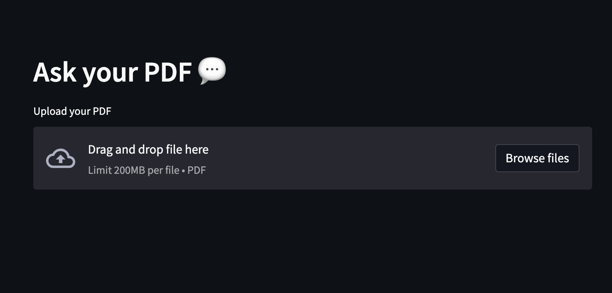
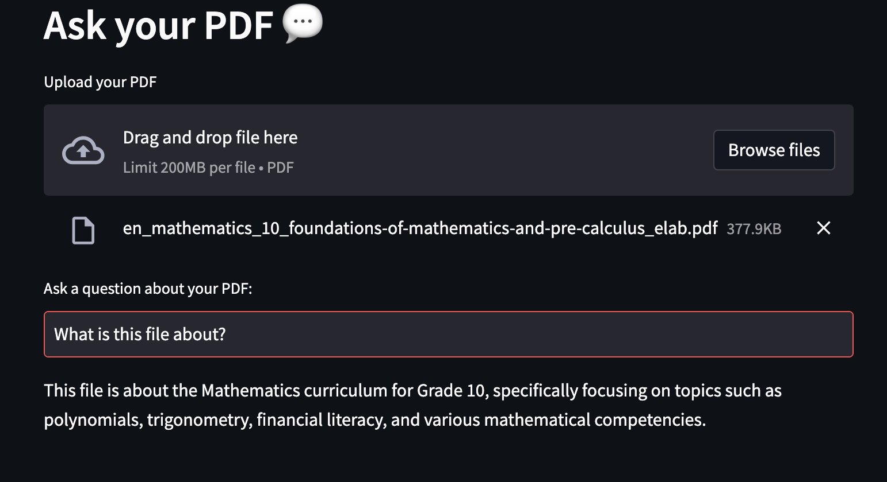
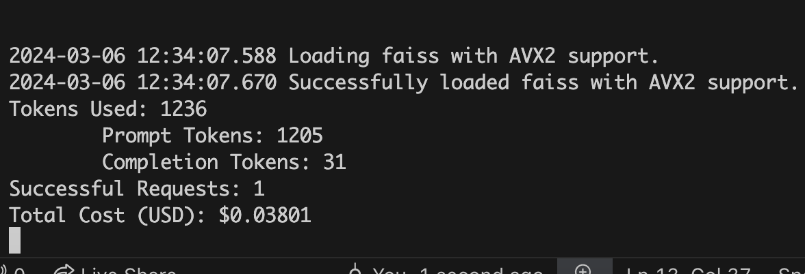

# CCTB Hackathon Prototype
---

## Table of content

- [Title](#cctb-hackathon-prototype)
- [Description](#description)
- [Credit](#credit)
- [How it works](#how-it-works)


## Theme of The Hackathon

Large language models (LLM) are a type of artificial intelligence that can generate human-like text. They have been used to generate text, answer questions, and even write code. 

For example, ChatGPT is one of the most popular LLMs. It is based on the GPT-3 model, which was developed by OpenAI. ChatGPT has been used to create chatbots, answer questions, and generate text. It has been used in a wide range of applications, including customer service, education, and entertainment.

<p align="center">
  
</p>


Meanwhile, building an LLM application is becoming more and more accessible. The goal of this hackathon is to build a prototype of an LLM application that can be used to solve a real-world problem. The modern tools like Langchain, Huggingface, and OpenAI are very helpful to build such an application.On another hand, libraries like Streamlit can be used to create a user-friendly interface for the application, which significantly reduces the idea-to-prototype time.


## Before You Start Coding.

### Obtain an OpenAI API Key from the Hackathon Organizers

When you start working this prototype, one of your teammate should reach out to the hackathon organizers to get the OpenAI API key. This key is required to use the OpenAI GPT models. Each team will only get one key and the key is valid for the duration of the hackathon.

### Know each other's strength

Before you start coding, it is important to know each other's strength. For example, if you have a teammate who is good at front-end development, you can assign them to work on the user interface. If you have a teammate who is good at natural language processing, you can assign them to work on the prompt engineering. Knowing each other's strength will help you to work more efficiently and produce a better prototype.

## Get Started

### The Prototype Overview

The prototype is a simple application that reads the PDF and splits the text into smaller chunks that can be then fed into a LLM. It uses OpenAI embeddings to create vector representations of the chunks. The application then finds the chunks that are semantically similar to the question that the user asked and feeds those chunks to the LLM to generate a response.

The application uses Streamlit to create the GUI and Langchain to deal with the LLM.


### Installation

To install the repository, please clone this repository and install the requirements:

#### Create a virtual environment (optional)

This step is optional but it is highly encouraged. If you are not using other virtual environment management tools. Feel free to use them too. 

Suppose you use the built-in Python virtual environment management module, let's call this virtual env `hack`

```
python3 -m venv hack

```

After creating the virtual environment, activate it:

```
source hack/bin/activate
```
If you want to deactivate the virtual environment, you can run:

```
deactivate
```
Then install the requirements:

```
pip3 install -r requirements.txt
```

You will also need to add the OpenAI API key to the `.env` file. If the file doesn't exist, create it. It should look like this:

```
OPENAI_API_KEY="your_api_key"
```

### Start the Application

To use the application, run the `main.py` file with the streamlit CLI (after having installed streamlit): 

```
streamlit run app.py
```

After a while, a new tab will open in your default browser with the application running. You can then use the application to ask questions and get answers.



There are some PDF files in the `pdfs` directory that you can use to test the application. You can also upload your own PDF files to test the application.

For example, if I upload the BC's math [curriculum](./pdfs/en_mathematics_10_foundations-of-mathematics-and-pre-calculus_elab.pdf) for grade 10 PDF and ask what is this file about.



And in the terminal, you can see that how much does it cost to generate the answer.




> Please refrain from using more expensive model like GPT-4 (set in llm.py) before you validate your prototype. The cost of using the expensive models can be very high and it can quickly consume your credit.

1. The PDF must be typed. Scanned PDFs are in general not supported.
2. PDFs must have a clean structure. If the PDF has a lot of images, tables, or other non-text elements, the application may not work as expected.


## Walkthrough of Code

Now let's walk through the code. You may be suprised that the code is very simple.

There are two main files: the [app.py](./app.py) and the [llm.py](./tool/llm.py) file. 

The `app.py` file contains the Streamlit application. It is a simple application that allows the user to upload a PDF file and ask questions about the content of the PDF file. The application then uses the `llm.py` file to find the answer to the question.


### app.py file

Let's look at the `app.py` file first.

The `get_openai_key` function and the `get_pdf_text` function are used to get the OpenAI API key and the text from the PDF file, respectively. The `get_openai_key` function reads the OpenAI API key from the `.env` file and the `get_pdf_text` function uses the `PyPDF2` library to read the text from the PDF file.


## Credit

The prototype was based on an early version of this [project](https://github.com/wsy258-strar/DocGPT). It is then customized for learning purposes.

The user thanks the author for the great work.